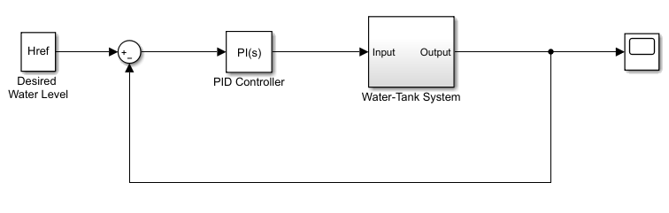
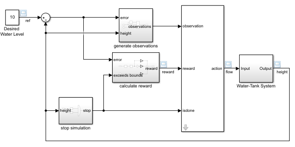
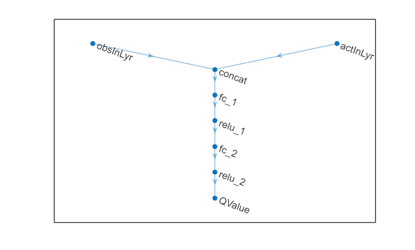
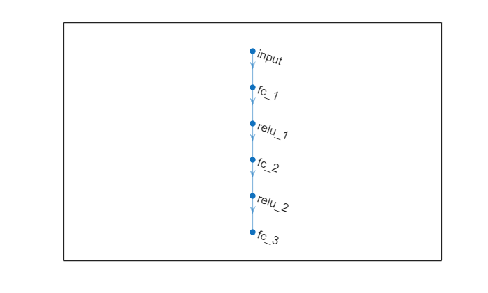
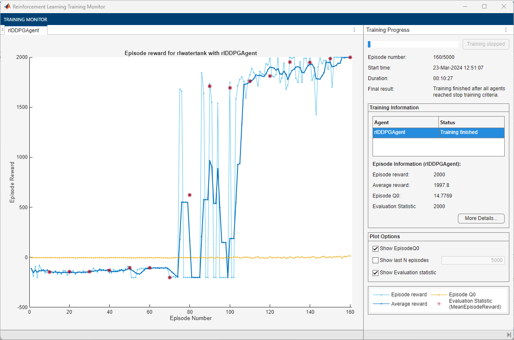
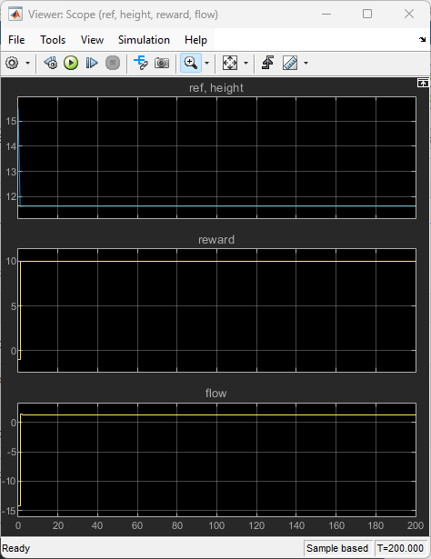

# Control Water Level in a Tank Using a DDPG Agent

This example shows how to convert the PI controller in the `watertank` Simulink® model to a reinforcement learning deep deterministic policy gradient (DDPG) agent. For an example that trains a DDPG agent in MATLAB®, see [Train DDPG Agent to Balance Double Integrator Environment](<docid:rl_ug#mw_0b71212e-521a-4a57-bde7-5dde0c1e0c90>).

# Fix Random Number Stream for Reproducibility

The example code might involve computation of random numbers at various stages. Fixing the random number stream at the beginning of various sections in the example code preserves the random number sequence in the section every time you run it, and increases the likelihood of reproducing the results. For more information, see [Results Reproducibility](<docid:rl_ug#mw_cfb4600e-9d19-4e4e-89c8-2749894fee3a>).


Fix the random number stream with seed zero and random number algorithm Mersenne Twister. For more information on controlling the seed used for random number generation, see [`rng`](<docid:matlab_ref#bsuymc2-1>).

```matlab
previousRngState = rng(0,"twister")
```

```matlabTextOutput
previousRngState = struct with fields:
     Type: 'twister'
     Seed: 0
    State: [625x1 uint32]

```


The output `previousRngState` is a structure that contains information about the previous state of the stream. You will restore the state at the end of the example.

# Water Tank Model

The original model for this example is the water tank model. The goal is to control the level of the water in the tank. For more information about the water tank model, see [watertank Simulink Model](<docid:slcontrol_ug#bsp4o3g>).





Modify the original model by making the following changes:

1.  Delete the PID Controller.
2. Insert the RL Agent block.
3. Connect the observation vector ${\left\lbrack \begin{array}{ccc} \int e\;\textrm{dt} & e & h \end{array}\right\rbrack }^{T\;}$, where $h$ is the height of the water in the tank, $e=r-h$, and $r$ is the reference height.
4. Set up the reward $\textrm{reward}=10\left(\left|e\right|<0\ldotp 1\right)-1\left(\left|e\right|\ge 0\ldotp 1\right)-100\left(h\le 0\left|\right|h\ge 20\right)$.
5. Configure the termination signal such that the simulation stops if $h\le 0$ or $h\ge 20$.

The resulting model is `rlwatertank.slx`. For more information on this model and the changes, see [Create Simulink Environment for Reinforcement Learning](<docid:rl_ug#mw_0e8060ca-2e7a-4d41-90d1-3bf4aeb76099>).

```matlab
open_system("rlwatertank")
```



# Create the Environment

Creating an environment model includes defining the following:

-  Action and observation signals that the agent uses to interact with the environment. For more information, see [rlNumericSpec](<docid:rl_ref#mw_1a66fdf2-e758-4985-a541-61943fb15e79>) and [rlFiniteSetSpec](<docid:rl_ref#mw_68f70adf-d6a9-4cbe-846c-a7d0823c0774>). 
-  Reward signal that the agent uses to measure its success. For more information, see [Define Reward Signals](<docid:rl_ug#mw_1fe437df-5904-43dc-8b75-1e25bb9ae3ff>). 

Define the observation specification `obsInfo` and action specification `actInfo`.

```matlab
% Observation info
obsInfo = rlNumericSpec([3 1],...
    LowerLimit=[-inf -inf 0  ]',...
    UpperLimit=[ inf  inf inf]');

% Name and description are optional and not used 
% by the software
obsInfo.Name = "observations";
obsInfo.Description = "integrated error, error," + ... 
    " and measured height";

% Action info
actInfo = rlNumericSpec([1 1]);
actInfo.Name = "flow";
```

Create the environment object.

```matlab
env = rlSimulinkEnv("rlwatertank","rlwatertank/RL Agent",...
    obsInfo,actInfo);
```

Set a custom reset function that randomizes the reference values for the model. The `localResetFcn` function is provided at the end of the example.

```matlab
env.ResetFcn = @localResetFcn;
```

Specify the agent sample time `Ts` and the simulation time `Tf` in seconds.

```matlab
Ts = 1.0;
Tf = 200;
```
# Create the Critic

DDPG agents use a parametrized Q\-value function approximator to estimate the value of the policy. A Q\-value function critic takes the current observation and an action as inputs and returns a single scalar as output (the estimated discounted cumulative long\-term reward for which receives the action from the state corresponding to the current observation, and following the policy thereafter).


To model the parametrized Q\-value function within the critic, use a neural network with two input layers (one for the observation channel, as specified by `obsInfo`, and the other for the action channel, as specified by `actInfo`) and one output layer (which returns the scalar value).


Define each network path as an array of layer objects. Assign names to the input and output layers of each path. These names allow you to connect the paths and then later explicitly associate the network input and output layers with the appropriate environment channel. Obtain the dimension of the observation and action spaces from the `obsInfo` and `actInfo` specifications. 

```matlab
% Observation path
obsPath = featureInputLayer(obsInfo.Dimension(1), ...
    Name="obsInLyr");

% Action path
actPath = featureInputLayer(actInfo.Dimension(1), ...
    Name="actInLyr");

% Common path
commonPath = [
    concatenationLayer(1,2,Name="concat")
    fullyConnectedLayer(25)
    reluLayer()
    fullyConnectedLayer(25)
    reluLayer()
    fullyConnectedLayer(1,Name="QValue")
    ];

% Create the network object and add the layers
criticNet = dlnetwork();
criticNet = addLayers(criticNet,obsPath);
criticNet = addLayers(criticNet,actPath);
criticNet = addLayers(criticNet,commonPath);

% Connect the layers
criticNet = connectLayers(criticNet, ...
    "obsInLyr","concat/in1");
criticNet = connectLayers(criticNet, ...
    "actInLyr","concat/in2");
```

View the critic network configuration.

```matlab
plot(criticNet)
```



Initialize the `dlnetwork` object and summarize its properties. The initial parameters of the critic network are initialized with random values. Fix the random number stream so that the network is always initialized with the same parameter values. 

```matlab
rng(0,"twister");
criticNet = initialize(criticNet);
summary(criticNet)
```

```matlabTextOutput
   Initialized: true

   Number of learnables: 801

   Inputs:
      1   'obsInLyr'   3 features
      2   'actInLyr'   1 features
```


Create the critic approximator object using the specified deep neural network, the environment specification objects, and the names if the network inputs to be associated with the observation and action channels. 

```matlab
critic = rlQValueFunction(criticNet, ...
    obsInfo,actInfo, ...
    ObservationInputNames="obsInLyr", ...
    ActionInputNames="actInLyr");
```

For more information on Q\-value function objects, see [`rlQValueFunction`](<docid:rl_ref#mw_e6e7abac-0a33-423b-8473-1409879db701>).


Check the critic with a random input observation and action.

```matlab
getValue(critic, ...
    {rand(obsInfo.Dimension)}, ...
    {rand(actInfo.Dimension)})
```

```matlabTextOutput
ans = single-0.4320
```


For more information on creating critics, see [Create Policies and Value Functions](<<docid:rl_ug#mw_2c7e8669-1e91-4d42-afa6-674009a08004>>).

# Create the Actor

DDPG agents use a parametrized deterministic policy over continuous action spaces, which is learned by a continuous deterministic actor.


A continuous deterministic actor implements a parametrized deterministic policy for a continuous action space. This actor takes the current observation as input and returns as output an action that is a deterministic function of the observation.


To model the parametrized policy within the actor, use a neural network with one input layer (which receives the content of the environment observation channel, as specified by `obsInfo`) and one output layer (which returns the action to the environment action channel, as specified by `actInfo`).


Define the network as an array of layer objects.

```matlab
actorNet = [
    featureInputLayer(obsInfo.Dimension(1))
    fullyConnectedLayer(25)
    reluLayer()
    fullyConnectedLayer(25)
    reluLayer()
    fullyConnectedLayer(actInfo.Dimension(1))
    ];
```

Convert the network to a `dlnetwork` object and summarize its properties. The initial parameters of the actor network are initialized with random values. Fix the random number stream so that the network is always initialized with the same parameter values. 

```matlab
rng(0,"twister");
actorNet = dlnetwork(actorNet);
summary(actorNet)
```

```matlabTextOutput
   Initialized: true

   Number of learnables: 776

   Inputs:
      1   'input'   3 features
```


View the actor network configuration.

```matlab
plot(actorNet)
```



Create the actor approximator object using the specified deep neural network, the environment specification objects, and the name if the network input to be associated with the observation channel. 

```matlab
actor = rlContinuousDeterministicActor(actorNet,obsInfo,actInfo);
```

For more information, see [`rlContinuousDeterministicActor`](<docid:rl_ref#mw_c2909424-90f4-4a52-803b-73310483e6c3>). 


Check the actor with a random input observation.

```matlab
getAction(actor,{rand(obsInfo.Dimension)})
```

```matlabTextOutput
ans = 1x1 cell array
    {[-0.1002]}

```


For more information on creating critics, see [Create Policies and Value Functions](<<docid:rl_ug#mw_2c7e8669-1e91-4d42-afa6-674009a08004>>).

# Create the DDPG Agent

Create the DDPG agent using the specified actor and critic approximator objects.

```matlab
agent = rlDDPGAgent(actor,critic);
```

For more information, see [`rlDDPGAgent`](<docid:rl_ref#mw_7e49ed9c-eea8-4994-8532-c7f66d5359ef>). 


Specify options for the agent, the actor, and the critic using dot notation. For this training:

-  Use an experience buffer with capcity 1e6 to store experiences. A larger experience buffer can store a diverse set of experiences. 
-  Specify the actor and critic learning rates to be 1e\-4 and 1e\-3 respectivelky. A large learning rate causes drastic updates which may lead to divergent behaviors, while a low value may require many updates before reaching the optimal point. 
-  Use a gradient threshold of 1 to clip the gradients. Clipping the gradients can improve training stability. 
-  Use mini\-batches of 400 experiences. Smaller mini\-batches are computationally efficient but may introduce variance in training. By contrast, larger batch sizes can make the training stable but require higher memory. 
-  The discount factor of 1.0 favors long term rewards. 
-  The sample time Ts=1.0 second is assigned to the agent. 
```matlab
agent.AgentOptions.SampleTime = Ts;
agent.AgentOptions.DiscountFactor = 1.0;
agent.AgentOptions.MiniBatchSize = 400;
agent.AgentOptions.ExperienceBufferLength = 1e6;

actorOpts = rlOptimizerOptions( ...
    LearnRate=1e-4, ...
    GradientThreshold=1);
criticOpts = rlOptimizerOptions( ...
    LearnRate=1e-3, ...
    GradientThreshold=1);
agent.AgentOptions.ActorOptimizerOptions = actorOpts;
agent.AgentOptions.CriticOptimizerOptions = criticOpts;
```

The DDPG agent in this example uses an Ornstein\-Uhlenbeck (OU) noise model for exploration. For the noise model:

-  Specify a standard deviation value of 0.3 to improve exploration during training. 
-  Specify a decay rate of 1e\-5 for the standard deviation. The decay causes exploration to reduce gradually as the training progresses. 
```matlab
agent.AgentOptions.NoiseOptions.StandardDeviation = 0.3;
agent.AgentOptions.NoiseOptions.StandardDeviationDecayRate = 1e-5;
```

Alternatively, you can specify the agent options using the [`rlDDPGAgentOptions`](<docid:rl_ref#mw_5e9a4c5d-03d5-48d9-a85b-3c2d25fde43c>) object.


Check the agent with a random input observation.

```matlab
getAction(agent,{rand(obsInfo.Dimension)})
```

```matlabTextOutput
ans = 1x1 cell array
    {[0.1015]}

```

# Train Agent

To train the agent, first specify the training options. For this example, use the following options:

-  Run each training for a maximum of 5000 episodes. Specify that each episode lasts for a maximum of `ceil(Tf/Ts)` (that is 200) time steps. 
-  Display the training progress in the Reinforcement Learning Training Monitor dialog box (set the `Plots` option) and disable the command line display (set the `Verbose` option to `false`). 
-  Evaluate the performance of the greedy policy every 10 training episodes, averaging the cumulative reward of 5 simulations. 
-  Stop training when the evaluation score reaches 2000. At this point, the agent can control the level of water in the tank. 

For more information on training options, see [`rlTrainingOptions`](<docid:rl_ref#mw_1f5122fe-cb3a-4c27-8c80-1ce46c013bf0>).

```matlab
% training options
trainOpts = rlTrainingOptions(...
    MaxEpisodes=5000, ...
    MaxStepsPerEpisode=ceil(Tf/Ts), ...
    Plots="training-progress", ...
    Verbose=false, ...
    StopTrainingCriteria="EvaluationStatistic", ...
    StopTrainingValue=2000);

% agent evaluator
evl = rlEvaluator(EvaluationFrequency=10,NumEpisodes=5);
```

Fix the random stream for reproducibility.

```matlab
rng(0,"twister");
```

Train the agent using the [`train`](<docid:rl_ref#mw_c0ccd38c-bbe6-4609-a87d-52ebe4767852>) function. Training is a computationally intensive process that takes several minutes to complete. To save time while running this example, load a pretrained agent by setting `doTraining` to `false`. To train the agent yourself, set `doTraining` to `true`.

```matlab
doTraining = false;
if doTraining
    % Train the agent.
    trainingStats = train(agent,env,trainOpts,Evaluator=evl);
else
    % Load the pretrained agent for the example.
    load("WaterTankDDPG.mat","agent")
end
```



# Validate Trained Agent

Fix the random stream for reproducibility.

```matlab
rng(0,"twister");
```

Simulate the agent within the environment, and return the experiences as output.

```matlab
simOpts = rlSimulationOptions( ...
    MaxSteps=ceil(Tf/Ts), ...
    StopOnError="on");
experiences = sim(env,agent,simOpts);
```

View the performance of the closed loop system using the Scope block in the Simulink model. The agent tracks the reference signal within 5 seconds.





Restore the random number stream using the information stored in `previousRngState`.

```matlab
rng(previousRngState);
```
# Local Reset Function
```matlab
function in = localResetFcn(in)

% Randomize reference signal
blk = sprintf("rlwatertank/Desired \nWater Level");
h = 3*randn + 10;
while h <= 0 || h >= 20
    h = 3*randn + 10;
end
in = setBlockParameter(in,blk,Value=num2str(h));

% Randomize initial height
h = 3*randn + 10;
while h <= 0 || h >= 20
    h = 3*randn + 10;
end
blk = "rlwatertank/Water-Tank System/H";
in = setBlockParameter(in,blk,InitialCondition=num2str(h));

end
```

*Copyright 2019\-2024 The MathWorks, Inc.*

